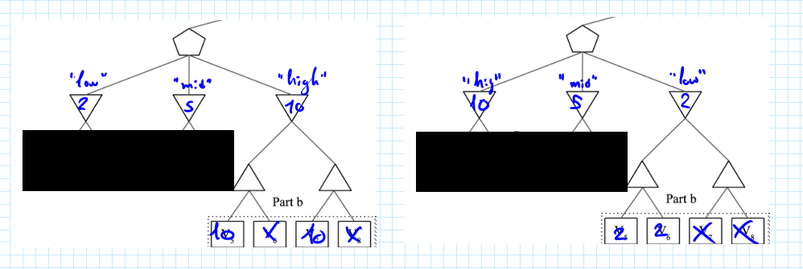
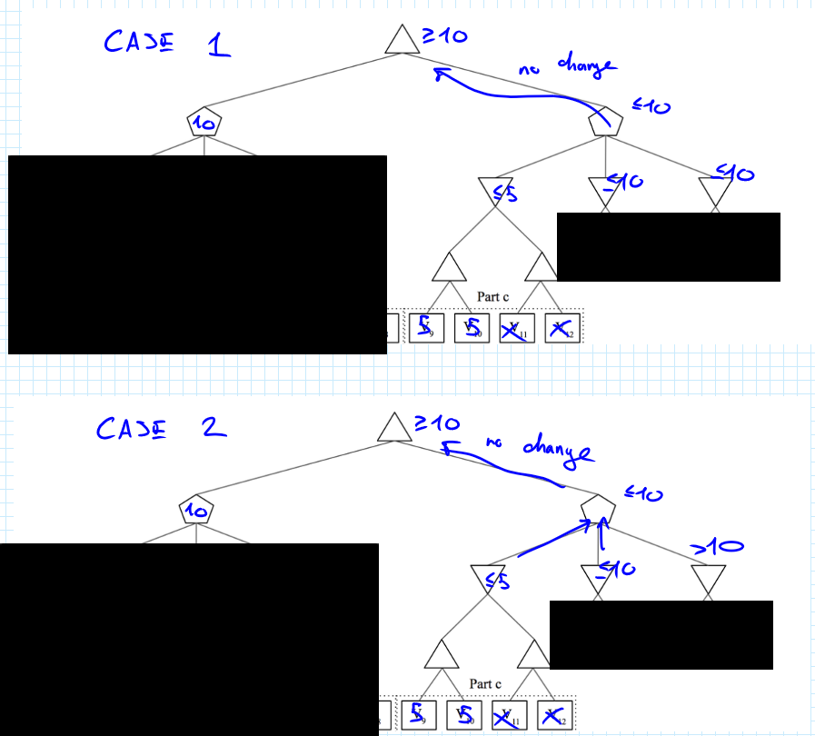
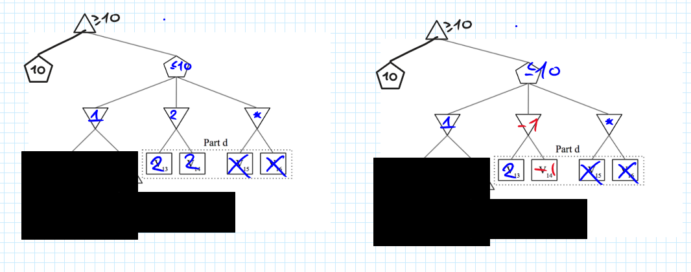
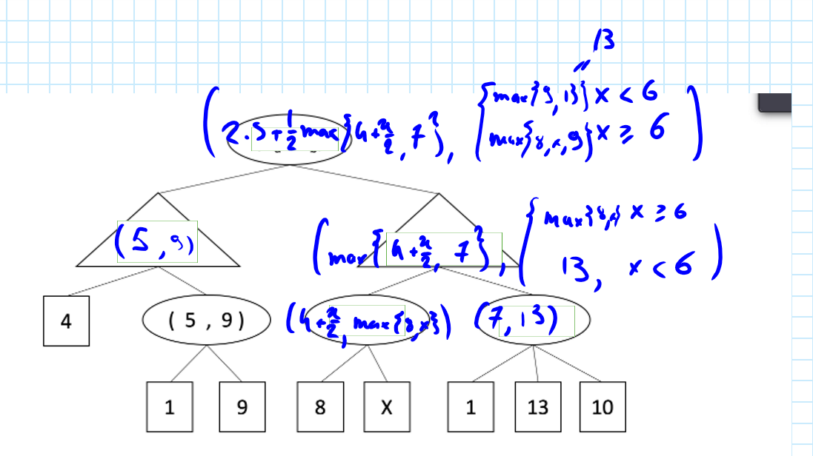

# Introduction to Artificial Intelligence
## Homework 6 Resolution by Dino Meng [SM3201466]

---

# Q1. MedianMiniMax

**Part A.** We do not prune any of the nodes of this part, as they are all necessary.

**Part B.** We have two pruning situations: one where we can prune $V_6$ and $V_8$, and another where we can prune $V_7, V_8$. Assuming the other two parallel minimizer' values are known (as we already explored them), and assume without loss of generality that the second minimizer is the "median minimizer".
1. If the visiting minimizer (the one above group B) would be the "high" minimizer, then it would be sufficient to visit the first values of each maximizer and find out their values are "sufficiently high", and the values cannot get lower.
2. If the visiting minimizer were to be the "low minimizer", then it is sufficient to visit the first maximizer and find out that its value is "sufficiently low" (by exploring both of the left-side maximizer's nodes) and since that the values cannot get higher, ignore the nodes associated to the other maximizer.

The figure below represents a possible configuration of the described situations:

**PART C.** Assume that the left "median" has value $10$, thus the root node has value at least $\geq 10$. Suppose that by exploring $V_9, V_{10}$ we obtain an upper bound on the left minimizer (for example, set $V_9=V_{10}=5$). Then we immediately notice that $V_{11}, V_{12}$ have no effect on the outcome of root's value, in fact:

* If the other two minimizers have value less than $10$, then the "medianizer" will always have a value less than $10$, confirming the lower bound of the root node
* If one minimizer has a value less than $10$ and another a value greater than $10$, then either the first minimizer (with value $\leq 5$) will be choosen as the median or the other minimizer with value less than $10$, which causes no change anyways
* If the other two minimizers have a value greater than $10$, then the minimum minimizer with value greater than $10$ will be choosen and change the root node's lower bound; however, the value cannot come from the first minimizer, meaning that $V_{11}, V_{12}$ had no effect on this outcome at all.

Therefore we can prune $V_{11}, V_{12}$.

**PART D.** Assume, like before, that the left median has value $10$ meaning that root node has value $\geq 10$. Suppose that the left-side minimizer has value $1$. As we explore $V_{13}$ and $V_{14}$ (for example let's set them to $2$), we immediately notice that we can discard $V_{15}, V_{16}$ because:

* If the right-side minimizer had value less than $1$, then the minimizer with value $2$ would be chosen, which does not affect the root node
* If the right-side minimizer had value greater than $2$, then the minimizer with value $1$ would be chosen, which does not affect the root node as well
* If the right-side minimizer had a value between $1$ and $2$, this minimizer would have been chosen which does not affect the root since it's value is lower than 10

Therefore, as the right-side minimizer's value is uninfluential, we can discard their associated nodes. Moreover notice how also $V_{14}$ can be discarded since that if it were an even lower value (for instance, $-1$) then the same situation described above would have happened, except that the left-side and center minimizers "swap roles" with each other.

---

# Q2. Games

Calculated values:

To answer the questions, just plug in the values of the figure above. Note that $C_b$ depends on the value $X$ as Bob knows how Alice estimates her value, so his value depends on "decision" made by Alice.

Pruning is not possible for Alice's "branch" as there are "chance nodes" and we have made no assumptions about the range of values prior.