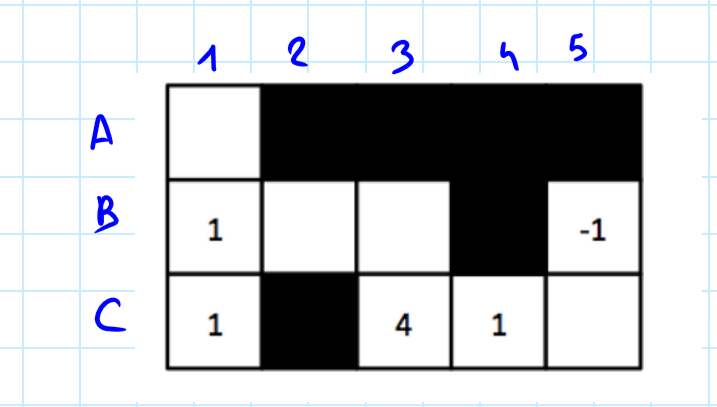
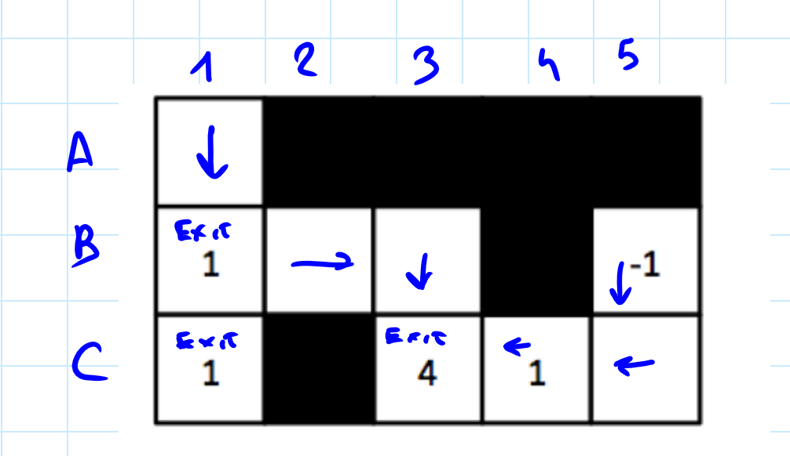
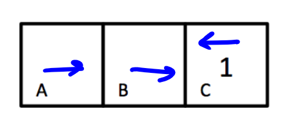
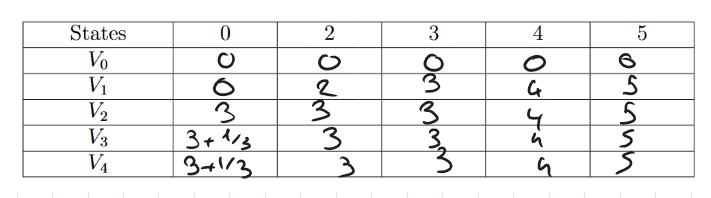
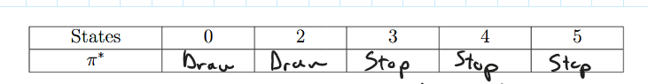

# Introduction to Artificial Intelligence
## Homework 7 Resolution by Dino Meng [SM3201466]

---

# Q1. MDPs: Reward Shaping

**(a)**

In this exercise, let us denote each tiles of the board as a couple $(\bullet, \bullet)$:

For instance, the tile with $-1$ will be identified as $(B,5)$ in this exercise.

Let us proceed the resolution. 

Observe that for each non-empty tile exiting is never a convenient choice, as it nets them a discounted reward of 0 and they can always get something "better" by heading towards a non-empty tile with positive reward and exit there. So we will exclude from said tiles the choice of *exiting*.

Now we will deduct the optimal choice for each tile by calculating possible rewards for each choice taken.

$(A,1)$: The only choice is to go down as observed before, so we will mark $\downarrow$

$(B,1)$: We can either *exit*, *go down* or *go right*. 

* Going down makes no sense as from there the only sensible choice would be to exit (otherwise I would return to the same tile, "wasting" reward as they are "weakened" from the discount $\gamma = 1/2$)
* Immediately exiting yields a reward of $1$ 
* Going right, right, down and exiting yields a reward of $0+(1/2)0+(1/4)0+(1/8)4=1/2$

So the best choice would be to immediately exit, so we mark $\texttt{EXIT}$ 

$(C,1)$: We can either go up or immediately exit. 
* Exit: Yields a reward of $1$
* Up: The next node is $(B,1)$ where I should exit. The reward yielded is $1$, which then gets saturated to $1/2$ due to the discount factor

So we mark $\texttt{EXIT}$ as it's the best choice

$(B,2)$: We can either go left or right.

* Left: We can then immediately exit, yielding the discounted sum of rewards $1/2$
* Right: We can go down and exit at $(C,3)$, yielding $0+1/2(0)+1/4(4)=1$

The best choice is then to go right, so we mark $\rightarrow$

$(B,3)$: Similar reasoning to $(B,2)$, except that it's even more evident that heading towards $(C,3)$ is better. So we mark $\downarrow$ 

$(C,3)$: The best course of action would be to exit, as it would yield the maximum reward $4$ in the whole scenario. So $\texttt{EXIT}$

$(C,4)$: We can either immediately exit or go left or go right.

* Right: Similarly to case $(B,1)$, going right makes no sense as I get no reward or even a negative value
* Left: I can exit on $(C,3)$, yielding the discounted reward $(1/2)4=2$
* Exit: Yields $1$ 

The best choice is therefore $\leftarrow$

$(C,5)$: Similar analysis to $(C,4)$. So the best choice is $\leftarrow$

$(B,5)$: In this case, exiting has a negative outcome so we must move *"somewhere"* to avoid that. In this case $\downarrow$ as it's the only choice.

To recap,

**(b)**. Firstly, we can calculate each value $F$ explicitly as the state-action space is sufficiently small.

| s | a             | s' | F  |
|---|---------------|----|----|
| A | $\rightarrow$ | B  | 10 |
| A | EXIT          | /  | 0  |
| B | $\leftarrow$  | A  | 0  |
| B | $\rightarrow$ | C  | 10 |
| B | EXIT          | /  | 0  |
| C | $\leftarrow$  | B  | 0  |
| C | EXIT          | /  | 0  |

Now, to compute the optimal policies we prooced state by state.

A: Of course $\rightarrow$, as it's the only action that yields a reward

B: We can exclude exiting as not only it does not produce a reward, it leads us to a terminal state without a chance of getting further rewards.

* Right: We immediately receive a reward of $10$
* Left: We can go right again, receiving the discounted reward $(1/2)10=5$

So $\rightarrow$ is the optimal choice

C: Exiting leads us to a "dead end" without any rewards. However, if we were to go left and right again, we would receive the discounted reward $5$. In fact, if we were to repeat this pattern forever we would converge towards "something positive", since that it's bounded by a convergent series:
$$
0 \leq \sum_{i=1,3,5,\ldots,(2n+1),\ldots}\frac{1}{2^i}10 \leq \sum_{i=1}\frac{1}{2^i}10 = \sum_{i=0}\frac{1}{2^i}10 - 10 = \frac{10}{1-0.5} - 10 = 20-10 = 10
$$
So the best choice is $\leftarrow$ as it would at least potentially yield some sort of reward

**(c)**. 0, because the agent never exits thus never getting any reward from the original environment

**(d)**. As observed previously, the problem lies in the fact that the agent might *"be encouraged"* to go *"back and forth"* forever to get an increasing reward. So one can *"discourage"* the agent from doing that by setting $x$ a sufficiently negative value such that the cost of *"going further from C"* outweights the reward of "*approaching towards C"*. For example, $x=-11$ causes the desired situation.

# Q2. Micro-Blackjack

**(a)**. We will fill a table of triples $(s, a, s')$ and their associated probabilities and rewards

| s | a    | s'  | P   | R |
|---|------|-----|-----|---|
| 0 | Draw | 2   | 1/3 | 0 |
|   | Draw | 3   | 1/3 | 0 |
|   | Draw | 4   | 1/3 | 0 |
|   | Stop | End | 1   | 0 |
| 2 | Draw | 4   | 1/3 | 0 |
|   | Draw | 5   | 1/3 | 0 |
|   | Draw | End | 0   | 0 |
|   | Stop | End | 1   | 2 |
| 3 | Draw | 5   | 1/3 | 0 |
|   | Draw | End | 2/3 | 0 |
|   | Stop | End | 1   | 3 |
| 4 | Draw | End | 1   | 0 |
|   | Stop | End | 1   | 4 |
| 5 | Draw | End | 1   | 0 |
|   | Stop | End | 1   | 5 |

**N.B.** If a field is empty, then it's the same as row above (column s)

To fill out the table, I have proceeded with the following "algorithm":

- For each state 0,2,4,5:
    - If draw, consider each possibility and sum it with the original state; if it's below 6, then let $s'$ the sum, otherwise let it be the end with reward 0
    - If stop, let it be end with reward of the number of the state

**(b)**.

Step 0: All of the values are 0, by definition

Step 1: Note that in all states it is never convenient to draw, as we will always get reward 0 by Bellman's equation for fixed policy "draw" (since that $V_0$ is initialized to zeroes). So $V_1(s) = s$.

Step 2: 

* 0: If I drawed, then the expected reward would be $2/3 + 3/3 + 4/3 = 9/3 = 3$. Otherwise, by staying the reward would have been 0. So by taking the max. the value is $3$
* 2: If I drawed, then the expected reward would be $4/3 + 5/3 = 9/3 = 3$, which is better than stopping as the reward would have been $2$. So by max. the value is $3$
* 3: Here drawing is not convenient anymore, as the expected reward would be $5/3$ which is lower than $3$, obtained by stopping. So the value is $3$
* 4: Remains the same, drawing is not convenient at all
* 5: Same as 4

Step 3: Note that the values for the states 4, 5 are stabilized and as a consequence so are 2, 3 as they depend on these values. The only one which can change is $0$

* 0: By drawing, the expected reward is $3/3+3/3+4/3 = 10/3 = 1+1/3$. Therefore, the value is $1+1/3$.

Step 4: Same as step 3, the values have stabilized

**(c)**. By repeating the reasoning done in (b), we conclude that:

* Drawing is convenient for 0,2
* Stopping is convenient for 3,4,5

